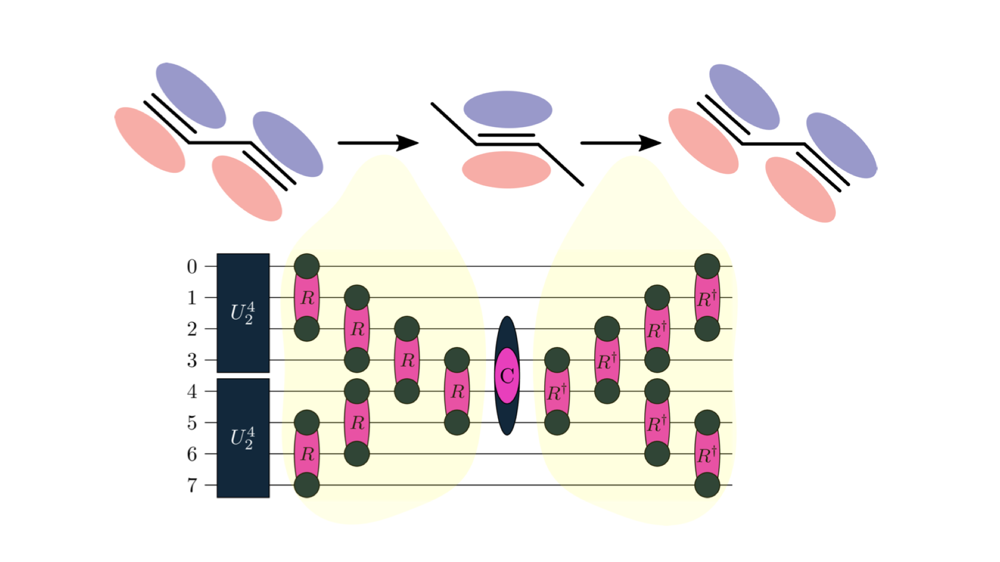

# Molecular Quantum Circuit Design

Talk I gave at the [Integrating Quantum Computers into Condensed Matter Simulations](https://iop.eventsair.com/cmd29/integrating-quantum-computers-in-condensed-matter-physics-simulations) mini-symposium at the [CMD29](https://cmd29.iopconfs.org/) IOP-conference in Manchester (August 2022).  
Slides are here: [Manchester-IOP.pdf](Manchester-IOP.pdf)  

### Relevant Papers:
- Graph Based Design of Molecular Circuits: [arxiv:2207.12421](https://arxiv.org/abs/2207.12421) (main part of the talk)  
- Separable Pair Approximations: [arXiv:2105.03836](https://arxiv.org/abs/2105.03836) (compact and classically simulable quantum circuits - more technical, concerns mostly the "automatisation" part in the end of the slides)  

### Further Reading
- Tequila Overview paper: [arxiv:2011.03057](https://arxiv.org/abs/2011.03057) (details on implementation not discussed in slides)  
- Automatically Differentiable Unitary Coupled-Cluster: [arxiv:2011.05938](https://arxiv.org/abs/2011.05938) (details on implementation not discussed in slides)  
- Basis-Set-Free VQEs: [arxiv:2008.02819](https://arxiv.org/abs/2008.02819) (concerns the automatisation part at the end of the slides)  
- Overview of Unitary Coupled-CLuster: [arXiv:2109.15176](https://arxiv.org/abs/2109.15176) (overview over other methods - does not contain the graph based approach presented here).  

### Relevant tequila tutorials (in NBViewer):  
- [Graph Based Construction](http://nbviewer.org/github/tequilahub/tequila-tutorials/blob/main/chemistry/GraphBasedCircuitDesign.ipynb): Explicit example for the presented H4 molecule.  
- [SPA ansatz](http://nbviewer.org/github/tequilahub/tequila-tutorials/blob/main/ChemistrySeparablePairAnsatz.ipynb): Examples for the SPA ansatz and a collection of precomputed basis-set-free representations of molecules (if you don't want to compile madness).  
- [madness-interface](http://nbviewer.org/github/tequilahub/tequila-tutorials/blob/main/ChemistryMadnessInterface.ipynb): If you want to compute your own molecular orbitals from scratch.    
